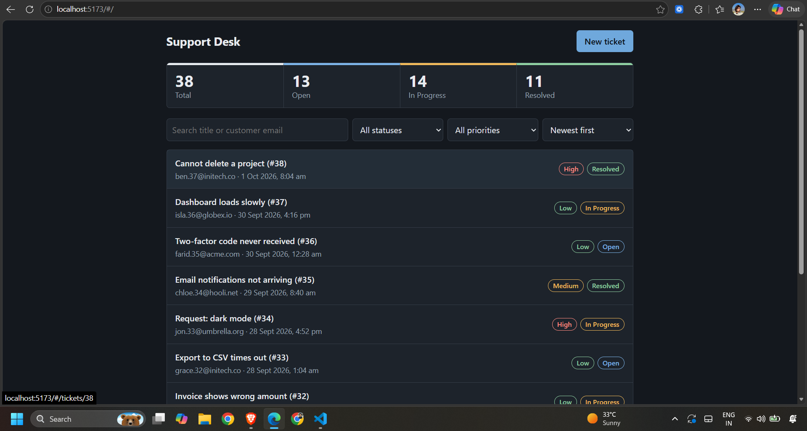
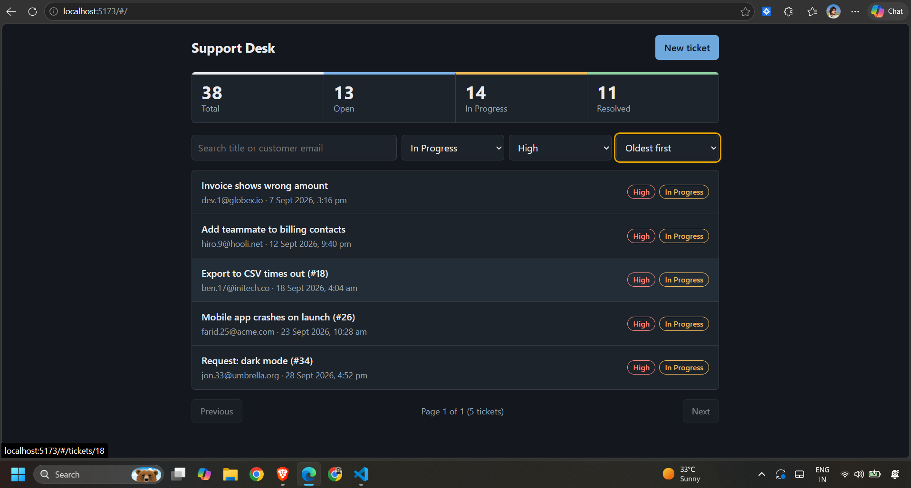
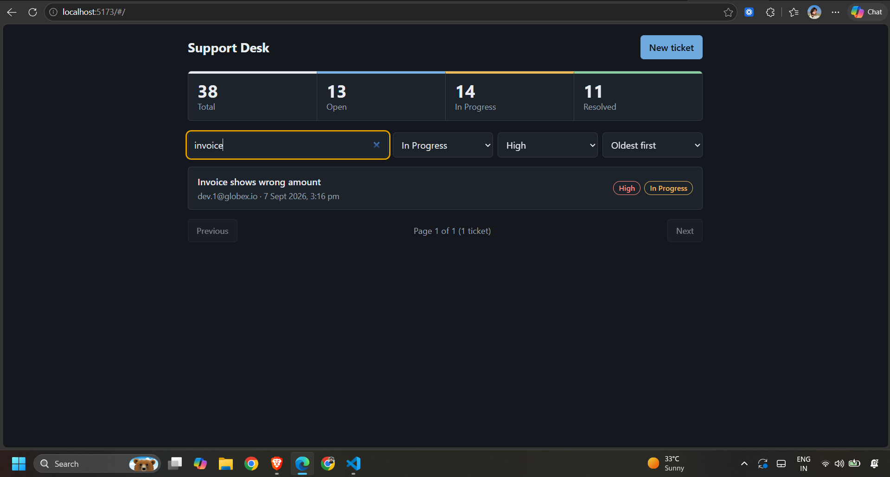
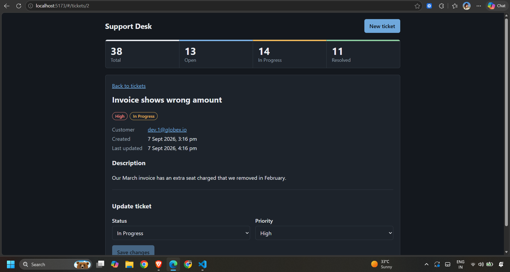
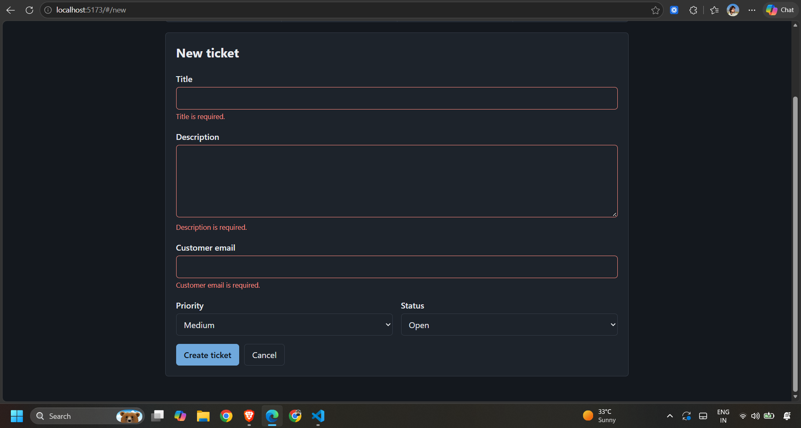
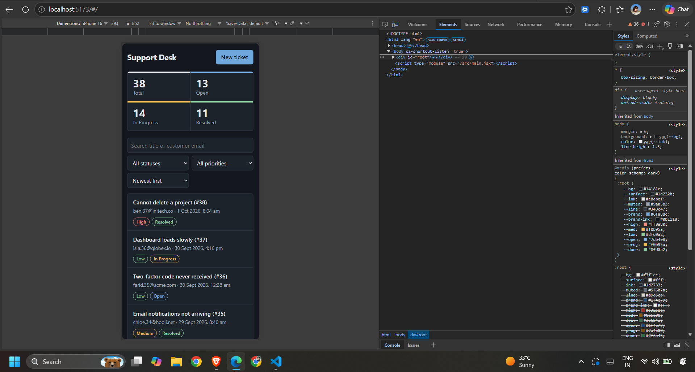

# Support Ticket Dashboard

A small full-stack app for a support team to create tickets, track status, and find requests that need attention.

- **Frontend:** React 18 + Vite (plain CSS, responsive, light/dark aware)
- **Backend:** Node.js 20+ / Express 4 REST API
- **Database:** SQLite via `better-sqlite3` (zero-setup, single file)
- **Tests:** Node's built-in test runner + Supertest (8 API tests)

## Quick start

Requires **Node.js 20 or newer** (developed on 22).

```bash
npm run install:all          # installs server + client dependencies
npm run seed                 # creates server/data/tickets.db with 38 sample tickets
npm run dev:server           # terminal 1 -> http://localhost:4000
npm run dev:client           # terminal 2 -> http://localhost:5173
```

Open http://localhost:5173.

The schema is created automatically on first start (`server/src/db.js`, `CREATE TABLE IF NOT EXISTS`).
Re-running `npm run seed` **wipes and re-seeds** the tickets table.

### Environment variables (all optional; defaults shown)

| Where | Variable | Default | Purpose |
|---|---|---|---|
| server | `PORT` | `4000` | API port |
| server | `DATABASE_PATH` | `./data/tickets.db` | SQLite file (relative to `server/`) |
| server | `CORS_ORIGIN` | `http://localhost:5173` | Allowed browser origin |
| client | `VITE_API_URL` | `http://localhost:4000/api` | API base URL |

See `.env.example` in each folder. Export variables in your shell to override.

### Run the tests

```bash
npm test
```
Each test gets a fresh in-memory SQLite database, so your dev data is untouched.

## API

Base path `/api`. Errors always look like `{ "error": { "code", "message", "details?" } }`.

| Method | Path | Description | Success |
|---|---|---|---|
| GET | `/tickets` | List. Query: `search`, `status`, `priority`, `sort=newest\|oldest`, `page` (10 per page) | 200 `{ items, total, page, pageSize, totalPages }` |
| POST | `/tickets` | Create (`title`, `description`, `customer_email`, `priority?`, `status?`) | 201 ticket |
| GET | `/tickets/:id` | Ticket details | 200 / 404 |
| PATCH | `/tickets/:id` | Update `status` and/or `priority` only | 200 / 400 / 404 |
| GET | `/tickets/summary` | `{ total, open, inProgress, resolved }` for the **whole** dataset | 200 |

Status codes: `400` validation (`VALIDATION_ERROR`, per-field `details`) or bad JSON (`INVALID_JSON`), `404` `NOT_FOUND`, `500` `INTERNAL_ERROR`.

## Project layout

```
server/src/
  db.js            connection + schema (CHECK constraints mirror validation)
  validation.js    ticket + list-query validation (pure functions)
  ticketsRepo.js   all SQL: list/search/filter/sort/paginate, summary
  routes.js        thin Express handlers
  errors.js        ApiError + central error handler
  app.js           app factory (takes a db -> easy to test)
  seed.js          38 varied tickets
server/test/       API tests
client/src/
  api.js           fetch wrapper, constants, client-side email regex
  App.jsx          layout, hash routing, summary refresh
  components/      TicketList, TicketForm, TicketDetail, Summary
  ui.jsx           Badge, Loading/Empty/Error states, Field
```

### Technical Choices

I kept the application intentionally simple and focused on the core support-ticket workflow.

For the backend, I used **Node.js with Express** to build a REST API. I separated the routes, validation, database access, and error handling instead of putting everything into one file. This makes the code easier to understand, test, and extend later.

For storage, I chose **SQLite with better-sqlite3** because the application doesn't need a separate database server. It gives me persistent data in a single file while keeping the database layer isolated in `ticketsRepo.js`. If the application grows, I can move the SQL logic to PostgreSQL without having to rewrite the entire API.

On the frontend, I used **React with Vite** and kept the UI lightweight with plain CSS. Since there are only a few views, I used simple hash-based routing instead of adding a routing library that wasn't necessary for this assignment.

One important part of the implementation was keeping **search, filtering, sorting, and pagination in SQL** rather than loading all tickets into the frontend. This keeps the API responsible for querying the data and will scale better as the number of tickets increases. User input is passed through bound parameters, and search wildcards are escaped to avoid unexpected SQL behavior.

I also added **server-side and client-side validation**. The frontend gives users immediate feedback, while the backend remains the final authority because API requests can come from anywhere, not just the React application.

For the summary cards, I created a separate `/tickets/summary` endpoint. This was intentional because the dashboard counts should represent the **entire ticket dataset**, regardless of whatever filters the user currently has applied.

### Assumptions

I made a few assumptions where the requirements were open to interpretation.

* Ticket titles and descriptions are trimmed before being stored.
* Email validation uses a practical regex rather than attempting to implement the complete RFC email specification.
* Search performs a case-insensitive substring search across the ticket title and customer email.
* A ticket can have an initial status when it is created, with `Open` as the default.
* After creation, only `status` and `priority` can be changed because those are the fields explicitly required by the PATCH API.
* The summary endpoint always returns counts for the complete dataset rather than the currently filtered list.

### Testing & Reliability

I added backend API tests using **Node's built-in test runner and Supertest**.

The tests use an in-memory SQLite database, so every test starts with a clean database. This means the tests don't modify the actual development database and can be run repeatedly without worrying about leftover data.

I also kept the Express application as a factory that accepts a database instance. That made it much easier to test the API independently from the production database configuration.

The API has centralized error handling so validation errors, invalid JSON, missing tickets, and unexpected server errors follow a consistent response structure.

### Known Limitations

There are a few things I intentionally left out because they were outside the scope of the assignment.

There is currently no authentication or authorization because the requirements didn't include user accounts or roles. There is also no ticket deletion or optimistic locking, so if two users update the same ticket at nearly the same time, the last update will win.

The current search uses SQL `LIKE`, which is fine for a relatively small dataset, but I wouldn't keep that approach for a very large ticket database. If the dataset became significantly larger, I would consider SQLite FTS or PostgreSQL full-text search and appropriate indexes.

I also focused the automated testing on the backend. The frontend doesn't currently have automated component tests, which would be one of the next things I'd add.

### Development Process & Time Spent

I spent approximately **4 hours** on the implementation:

* **~2 hours:** Backend API, database structure, validation, and tests
* **~1 hours:** React frontend, ticket creation/list/detail views, filters, and summary
* **~1 hour:** Integration, debugging, responsive styling, documentation, and cleanup

I also used an AI assistant during development to help generate the initial project structure and some boilerplate. I treated that as a development aid rather than something I could blindly rely on. I reviewed the generated code, ran the tests, checked the API behavior, and made changes where necessary.

The main goal was to understand the complete flow myself — from the React form, to the API request, to validation, database operations, and finally returning the updated data to the UI. I can explain the implementation and modify any of these parts if requirements change.


## Screenshots

**Ticket list with summary counts**


**Search and filters**


**Search**


**Ticket details and update**


**Form validation errors**


**Mobile view**
